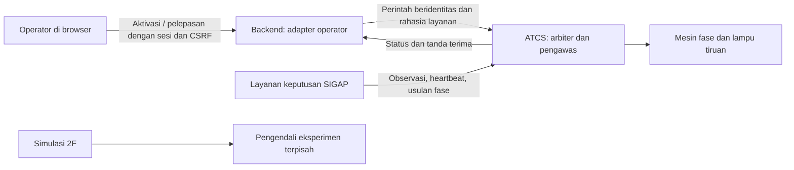

# SIGAP–ATCS: integrasi, override, dan fallback — Tahap 3/4

Implementasi ini menghubungkan layanan keputusan dengan **ATCS tiruan lokal**. Protokol, penerimaan perintah, transisi lampu dan fallback benar-benar dijalankan oleh proses ATCS. CCTV/YOLO, algoritma adaptif operasional dan perangkat ATCS lapangan belum terhubung. Pengirim pada `integration_lab` adalah skrip uji dengan sumber `integration_test`, bukan deteksi video.

## Kepemilikan kendali



ATCS selalu menjalankan proses dan jamnya. Default adalah fixed-time U → T → S → B, hijau 85/150/95/100 detik, kuning 3 detik dan semua merah minimum 2 detik. SIGAP hanya mendapat sesi kendali sementara; ATCS tetap pemilik sinyal dan pembatas durasi. Berpindah tab, jeda/reset/kecepatan eksperimen tidak mengubah sesi maupun waktu ATCS.

Urutan fixed-time dilanjutkan dari pendekat setelah fase terakhir yang dilayani saat kembali dari SIGAP, setelah clearance aman. Jam dan `run_id` ATCS tidak direset. Ini bukan dua pengendali yang sama-sama boleh menulis lampu atau pemutaran fase tertunda.

## Alur aktivasi dan pemulihan

1. Sumber tepercaya mengirim kualitas dan timestamp pengamatan **empat pendekat**. ATCS memeriksa umur masing-masing; status proses hidup saja tidak cukup.
2. Operator meminta aktivasi berdasarkan `atcs_run_id` dan `revision` terbaru. Sumber harus siap, dan ATCS harus berada pada fixed-time. Dashboard hanya menerima sumber berlabel `cctv`; lab memakai jalur mesin pada instance terpisah.
3. ATCS mengeluarkan `session_id`. Tanda terima masih **accepted**, belum berarti SIGAP mengendalikan lampu. Sumber mulai heartbeat dan mengirim rencana fase.
4. Setelah hijau minimum, kuning penuh, semua merah minimum dan area konflik kosong, ATCS menerapkan fase/durasi yang valid. Tanda terima aktivasi dan rencana berubah **applied**. Pengendali dilaporkan SIGAP.
5. Jika data tidak layak/basi, heartbeat hilang, keputusan kedaluwarsa/tidak tersedia, sumber berganti proses, atau operator melepas kendali, sesi dicabut segera. Perintah sesi lama ditolak sejak saat itu.
6. Lampu menyelesaikan minimum hijau yang diperlukan, kuning penuh dan semua merah. Area konflik occupied/unknown menahan semua merah. Setelah aman, ATCS kembali fixed-time.
7. Pulihnya heartbeat/data tidak mengaktifkan SIGAP otomatis. Sumber harus siap dan operator meminta aktivasi baru. Restart ATCS menghasilkan `run_id` baru dan startup semua merah; perintah dari sesi ATCS lama ditolak.

Jika rencana berikutnya belum tersedia setelah fase SIGAP selesai, ATCS menunggu pada semua merah dengan `clearance_state=waiting_command`, dibatasi pengawas keputusan. Countdown ini berasal dari ATCS. `waiting_conflict` memakai countdown null karena waktu keluarnya kendaraan belum diketahui.

## Batas prototipe yang digunakan

| Aturan | Default | Penjelasan |
|---|---:|---|
| Heartbeat | 3 detik | Deadline monotonic sejak heartbeat sah terakhir |
| Data pengamatan | 3 detik per pendekat | Dihitung dari waktu frame; mengirim ulang timestamp yang sama tidak memperpanjang umur |
| Menunggu rencana | 8 detik | Saat aktivasi; atau setelah hijau + kuning + semua merah fase SIGAP |
| Hijau SIGAP | 10–60 detik | Rencana tidak boleh memperpanjang hijau aktif secara langsung |
| Umur pengiriman perintah | Maks. 5 detik | `expires_at` harus masih berlaku; operator adapter memakai 3 detik |
| Horizon keputusan | Maks. 180 detik | Saat penerapan harus cukup untuk seluruh hijau yang diminta |
| Toleransi jam sumber | 1 detik | Timestamp terlalu jauh di masa depan ditolak |

Ini **nilai rekayasa prototipe**, bukan konfigurasi terverifikasi Dishub. Definisi berada pada `contracts/control.py`. Kuning/semua merah tetap membaca `configs/intersection.json`. Lab proses menggunakan fixture terpisah: hijau minimum 1 detik, heartbeat/data 2 detik, fixed-green 3 detik, kuning/semua merah 1 detik. Fixture lab tidak menimpa baseline utama.

## Endpoint

| Metode dan alamat | Pengguna | Fungsi |
|---|---|---|
| GET `/control` pada ATCS | Diagnostik internal | State, revision, kesiapan, sumber, sesi, deadline, alasan dan kejadian |
| POST `/control/commands` pada ATCS | Layanan dengan bearer key | `observe`, `activate`, `heartbeat`, `plan`, `release` |
| GET `/control/receipts/{request_id}` pada ATCS | Layanan dengan bearer key | Hasil penerimaan/penerapan perintah |
| GET `/api/control` pada backend | Operator login | Status kendali yang diverifikasi identitas simpangnya |
| POST `/api/control/commands` pada backend | `control:operate`, origin dan CSRF | Aktivasi atau pelepasan; browser tidak boleh mengirim observasi, heartbeat atau fase |
| GET `/api/control/receipts/{request_id}` pada backend | Operator login | Memeriksa hasil permintaan, termasuk setelah respons POST terputus |

Semua perintah mesin memuat UUID `request_id`, `atcs_run_id`, `sender_id`, `action`, `issued_at`, `expires_at`. Tambahan wajib:

| Action | Field tambahan |
|---|---|
| observe | `sequence`, `source`, `observations` dengan U/T/S/B; setiap pengamatan berisi `observed_at`, `usable` |
| activate | `expected_revision` |
| heartbeat | `session_id`, `sequence` |
| plan | `session_id`, `sequence`, `approach`, `green_seconds`, `plan_valid_until` |
| release | `session_id`, `expected_revision` |

Field di luar bentuk action ditolak. Gunakan envelope JSON yang sama ketika mengulang permintaan dengan ID yang sama; timestamp pengiriman tidak diperbarui pada retry. Duplikat mengembalikan tanda terima sebelumnya tanpa menerapkan ulang atau memperbarui heartbeat. ID sama dengan isi berbeda ditolak. Sequence observasi, heartbeat, dan rencana diperiksa terpisah; rencana baru dapat mengganti rencana antre, dengan tanda terima lama `cancelled/SUPERSEDED`.

Tanda terima memiliki outcome `accepted`, `applied`, `rejected`, `cancelled`, kode/alasan, waktu, run, sesi dan revision. HTTP 200 mencakup **accepted** yang masih menunggu; jangan menyamakan 200 dengan perubahan lampu. Penolakan semantik menggunakan 409 dan tanda terima; bentuk salah 422; rahasia salah 401. Koneksi/hasil upstream yang tidak dapat diverifikasi memberi 503. Dashboard membaca ulang tanda terima, tidak mengirim ulang aktivasi otomatis.

## Batas kepercayaan dan penyimpanan

- `SIGAP_CONTROL_API_KEY` harus sama pada backend/ATCS, minimal 32 karakter acak. Disimpan hanya di `.env`/environment server, tidak di VITE atau browser. Kunci kosong menonaktifkan command API; fixed-time tetap berjalan.
- `ATCS_ENABLE_TEST_SOURCE=false` pada instance utama dan Compose. Flag hanya diaktifkan oleh lab yang membuat instance/port/rahasia sementara sendiri.
- Semua akun saat ini role operator, berizin `monitor:read` dan `control:operate`. Backend tetap memeriksa izin kendali secara eksplisit. Ini belum sistem administrasi peran lewat UI.
- Sumber yang memegang rahasia dipercaya melaporkan `usable` dan waktu frame secara benar. Pemeriksaan kualitas video/kalibrasi/inferensi yang sebenarnya merupakan tahap berikutnya; boolean kesiapan bukan pengganti validasi CCTV.
- ATCS menyimpan 512 tanda terima terakhir, melindungi perintah transisi/rencana yang masih relevan; 100 kejadian kontrol dan 1.000 kejadian fase. Backend menyimpan 512 envelope operator untuk retry. Semuanya dalam memori, bukan audit persisten. Tidak ada jaminan retensi setelah restart.
- Semua pembacaan status tidak menjalankan timer. Watchdog tetap bekerja tanpa browser/backend/database. Jika proses/host ATCS sendiri mati, software ini tidak menjamin lampu fisik tetap bekerja; status dinyatakan tidak tersedia. Redundansi perangkat belum termasuk cakupan ini.
- Satu worker backend dan satu worker ATCS; tidak ada replikasi state antarproses. Endpoint diagnostik ATCS tetap internal localhost.

## Mengulang uji dua proses

Dari root proyek, jalankan satu perintah untuk setiap skenario:

```powershell
.\.venv\Scripts\python.exe -m integration_lab --scenario sender-stop --output work/lab-sender-stop
.\.venv\Scripts\python.exe -m integration_lab --scenario data-freeze --output work/lab-data-freeze
.\.venv\Scripts\python.exe -m integration_lab --scenario release --output work/lab-release
```

Lab membuka port lokal sementara, membuat ATCS dan pengirim sebagai proses berbeda, lalu menutup keduanya. Skenario sender-stop mematikan proses pengirim dan tidak membaca status selama delapan detik; ATCS harus tetap melakukan fallback. Data-freeze mempertahankan proses dan heartbeat tetapi mengulang waktu frame lama. Release memeriksa accepted → applied. Setiap skenario memastikan ATCS tetap pada run yang sama dan heartbeat sesi lama ditolak. Hasil dan log berada di folder output. Tidak diperlukan browser, PostgreSQL, atau penghentian ATCS utama.

Panel SIGAP pada web menunjukkan kesiapan, heartbeat/data, alasan kendali, tindakan operator dan riwayat. Tombol aktivasi utama tetap nonaktif sampai integrasi sumber CCTV tersedia. Ruang Simulasi 2F tetap tempat percobaan kendaraan/adaptif/EVP yang terpisah. Tahap berikutnya adalah **5 — Menghubungkan heuristik data buatan ke protokol dan mengevaluasinya**, bukan pelatihan YOLO otomatis.
