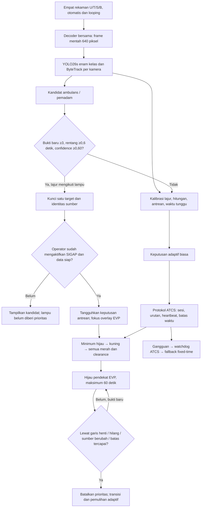

# EVP video — implementasi dan validasi v6

Tanggal: 8 Oktober 2026. Lingkup: demonstrasi lokal SIGAP dengan pengendali ATCS tiruan; bukan perangkat pengendali lampu lapangan.

## Penyebab masalah dan perubahan

Model lama mengklasifikasikan ambulans pada rekaman terbaru sebagai kendaraan biasa. Selain masalah klasifikasi, jalur operasional belum mengirim permintaan prioritas dari hasil video ke pengendali; prioritas yang tersedia sebelumnya berasal dari simulasi. Memperbaiki label/model saja tidak menyambungkan prioritas. Versi ini menghubungkan tracking, verifikasi temporal, permintaan prioritas, transisi lampu, dan pemulihan.

Sumber: SIGAP-YOLO/source-videos/ambulance/ambulance-01.mp4, Drive file 1-4pJ5DxoGwrqF4c2IacIt1YYRk5Hipyc. SHA256 327ee3bf8b73ca471e3193ffad7447fecefa0469f5ebddec42c944611df947f6. Rekaman lokal yang dipilih pada U sama persis dengan sumber ini. Durasi 108,4 detik, 1440×1080, 30 FPS. Bukti visualnya adalah van putih dengan lampu atap; suara sirene belum diverifikasi. Sistem demonstrasi memakai kelas visual ambulans/pemadam sebagai kandidat EVP, bukan membuktikan kendaraan sedang dalam misi darurat.

## Alur sistem

## Aturan operasional

- Kandidat hanya berasal dari pengamatan tracking yang baru, kelas ambulance/fire_truck, confidence minimal 0,60, kalibrasi valid, dan lajur middle/inner. Ruas pintas kiri bebas tidak meminta override.
- Minimal tiga frame berbeda dengan rentang pengamatan 0,6 detik. Frame yang diulang, kotak coasted/memori tampilan, dan perubahan kelas tidak membuat bukti baru.
- Target dikunci: pendekat, ID tracking, sesi rekaman dan generasi tracker. Target lain menunggu, sehingga perubahan peringkat tidak membuat lampu berganti-ganti.
- Kehilangan bukti 1,2 detik memulai pemulihan. Pengendali secara mandiri menolak bukti ≥2 detik, urutan mundur, sesi salah, confidence lemah dan identitas berubah. Bukti duplikat tidak memperpanjang lease.
- Bukti melewati garis henti memakai kedua tepi vertikal kotak, supaya bagian belakang kendaraan masih dilayani ketika bagian depannya sudah lewat.
- Keputusan antrean biasa ditangguhkan selama target terkunci. Kotak kendaraan biasa disembunyikan pada overlay fokus EVP. Inferensi/pengamatan latar tetap dijalankan untuk kesehatan kamera, jumlah peta, dan pemulihan; tidak dibuat kendaraan atau confidence palsu.
- Mesin ATCS memegang waktu dan sinyal. Minimum hijau mengikuti policy (10 detik pada konfigurasi pengujian), kuning 3 detik, semua merah minimal 2 detik, kemudian area konflik harus clear. Kondisi occupied/unknown menahan semua merah. Maksimum pelayanan prioritas 60 detik; pembaruan bukti tidak mengulang durasi hijau.
- Hilang/pindah sumber/lewat/batas pelayanan membatalkan prioritas. Pengakuan pemulihan menunggu fase semua merah atau kendali fixed-time, bukan langsung ketika target dihapus dari memori.
- Aktivasi awal memerlukan operator. Membuka halaman atau memilih tab SIGAP tidak mengambil alih lampu. ATCS tetap memiliki fallback independen bila SIGAP gagal.
- Video rekaman tidak bereaksi terhadap lampu simulasi. Kendaraan pada rekaman terus bergerak sesuai rekaman; peta dan kontrol adalah demonstrasi dari pengukuran yang tersedia, bukan rekonstruksi kausal lalu lintas lapangan.

## Pelatihan dan pembatasan tiga jam

Training menggunakan GPU T4 Colab, time=2.0 jam dan batas keras batch sebelum 03.55 WIB. Waktu persiapan, evaluasi, pemasangan dan uji disediakan dalam jendela keseluruhan tiga jam. epochs=100 hanya batas atas; Ultralytics menentukan jumlah epoch yang muat dalam batas waktu. Hasil aktual, bukan batas atas, dicatat pada laporan validasi.

Data baru: 45 frame training dari jendela yang identitas ambulansnya lebih jelas (≥60 detik). Kotak target diperiksa pada anchor visual; propagasi memakai detektor dan pemeriksaan overlap. Dua belas frame review dari blok waktu yang dikeluarkan dari training, dengan buffer temporal. Training mempertahankan 1.800 frame umum dan 411 frame berlabel kendaraan darurat dari dataset lama; 45 frame tambahan diberi bobot melalui pengulangan 14 kali, total 2.841 entri training. Pengulangan bukan 630 gambar baru yang independen.

Enam kelas tetap car, motorcycle, bus, truck, ambulance, fire_truck. Evaluasi public validation memakai 811 gambar dari split lama, terpisah dari training. Review klip memakai video yang sama dan label bantu propagasi, sehingga tidak membuktikan generalisasi kamera lain atau anotasi manual lengkap. Rekaman pemadam nyata terbaru belum tersedia.

Baseline, best dan last diperiksa pada target ambulans dengan input ukuran yang sama dengan website (640×480), bukan hanya resolusi training 960. Deployment harus memakai checkpoint yang evaluasi dan hash-nya sesuai; model-card.json mengikat evaluation.json ke SHA256 best.pt. Dashboard menampilkan metrik per kelas, sumber uji dan batas validasinya.

## Bukti pengujian

Tes deterministik mencakup ambulans/pemadam × empat pendekat, minimum hijau, kuning, semua merah, area konflik, sinyal hijau tunggal, bukti lemah/basi/ulang, perubahan identitas, data hilang, pembatalan rencana tertunda, kunci target, target kedua, kehilangan klasifikasi, serta pipeline AdaptiveSender → ATCS → pemulihan. Panel frontend dan API mutu model juga diuji. Hasil akhir tersimpan di work/evp-20261008 pada workspace Codex dan dirangkum dalam evp-validation-v6.md.

## Menjalankan dan menghentikan

Di folder PROJECT-SIGAP-ASTRA: nyalakan Docker Desktop, lalu jalankan docker compose up -d db. Jalankan powershell.exe -NoProfile -ExecutionPolicy Bypass -File .\scripts\start-sigap.ps1. Script membaca SIGAP_YOLO_MODEL dari .env atau parameter -ModelPath; model lama tetap tersimpan sebagai cadangan. Website: http://127.0.0.1:15173/login. Gunakan akun operator yang sudah ada; pemasangan tidak mengubah kata sandi.

Untuk uji: periksa empat kamera dan kalibrasi, aktifkan kendali SIGAP, tunggu ambulans U mendekati garis henti. Panel EVP memperlihatkan konfirmasi, pelayanan dan pemulihan. Riwayat pengendali merekam awal/akhir prioritas; pembaruan bukti tidak memenuhi panel kejadian setiap setengah detik. Hentikan memakai scripts/stop-sigap.ps1 ketika pengujian selesai.

## Kriteria yang masih memerlukan data nyata

Implementasi dan tes software tidak sama dengan akurasi lapangan 100%. Hitungan pada arus motor padat, antrean/waktu tunggu manual di empat kamera, false positive ambulans pada video lain, pemadam nyata, dan aktivasi sirene memerlukan dataset/bukti tambahan. TomTom adalah konteks kecepatan arus wilayah; grafik perbandingan simulasi bukan bukti dampak kausal di jalan. Keterbatasan ini tetap ditampilkan dan tidak ditutup dengan angka buatan.

Tambahan aturan pemulihan: deteksi sebelum operator mengaktifkan SIGAP tidak menghabiskan batas pelayanan. Jika klasifikasi hilang sementara, target dapat diverifikasi ulang sesudah cooldown tiga detik dan pemulihan lampu; target yang sepenuhnya lewat atau mencapai batas pelayanan tidak diaktifkan ulang dalam generasi tracker yang sama.
